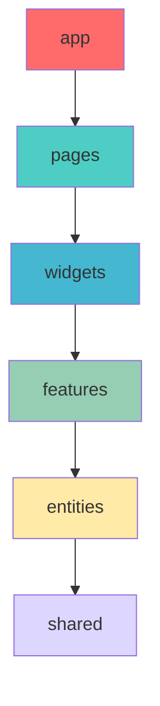

# 🥋 주짓수 출석 관리 시스템

주짓수 도장 관원들의 출석, 회비, 승급 히스토리를 체계적으로 관리하는 웹 애플리케이션입니다.

## 🛠️ 기술 스택

### Frontend


### Libraries & Tools


### Backend & Database


### Deployment


## 📖 프로젝트 설명

### 주요 기능

- **출석 관리**: 관원들의 일별 출석 현황 및 시간대별 출석 기록
- **회비 관리**: 회비 납입 이력 및 다음 납입 예정일 알림
- **승급 히스토리**: 벨트 승급 기록 및 진급 과정 추적
- **공지사항**: 도장 소식 및 중요 안내사항 전달
- **개인 대시보드**: 관원별 맞춤형 정보 제공

## 🏗️ 아키텍처 및 폴더 구조

### FSD (Feature-Sliced Design) 아키텍처

이 프로젝트는 **Feature-Sliced Design** 아키텍처를 따릅니다. FSD는 React 애플리케이션의 확장성과 유지보수성을 높이는 현대적인 아키텍처 패턴입니다.

#### FSD의 핵심 원칙

- **계층별 분리**: app, pages, features, entities, shared 계층으로 구분
- **수직적 슬라이싱**: 비즈니스 도메인별로 코드 분리
- **계층 간 의존성 규칙**: 하위 계층은 상위 계층을 알지 못함

### 폴더 구조

```
jiujitsu-plus-dashboard/
├── public/
│   ├── favicon.ico
│   └── images/
├── src/
│   ├── app/                    # 🔥 [Layer 1] Application 계층
│   │   ├── providers/
│   │   │   ├── QueryProvider.tsx      # TanStack Query 설정
│   │   │   ├── ThemeProvider.tsx      # 테마 설정
│   │   │   └── index.ts
│   │   ├── store/
│   │   │   ├── index.ts               # 전역 상태 스토어
│   │   │   └── atoms/                 # Jotai atoms
│   │   └── styles/
│   │       └── globals.css            # 전역 스타일
│   │
│   ├── pages/                  # 🔥 [Layer 2] Pages 계층 (Routes)
│   │   ├── index.tsx                  # 홈페이지 (/)
│   │   ├── login.tsx                  # 로그인 (/login)
│   │   ├── dashboard/
│   │   │   ├── index.tsx              # 대시보드 (/dashboard)
│   │   │   ├── admin.tsx              # 관리자 대시보드 (/dashboard/admin)
│   │   │   └── member.tsx             # 관원 대시보드 (/dashboard/member)
│   │   ├── members/
│   │   │   ├── index.tsx              # 관원 목록 (/members)
│   │   │   ├── create.tsx             # 관원 등록 (/members/create)
│   │   │   └── $memberId/
│   │   │       ├── index.tsx          # 관원 상세 (/members/123)
│   │   │       └── edit.tsx           # 관원 수정 (/members/123/edit)
│   │   ├── attendance/
│   │   │   ├── index.tsx              # 출석 목록 (/attendance)
│   │   │   ├── check.tsx              # 출석 체크 (/attendance/check)
│   │   │   └── calendar.tsx           # 출석 달력 (/attendance/calendar)
│   │   ├── payments/
│   │   │   ├── index.tsx              # 회비 관리 (/payments)
│   │   │   ├── create.tsx             # 회비 등록 (/payments/create)
│   │   │   └── history.tsx            # 회비 이력 (/payments/history)
│   │   ├── promotions/
│   │   │   ├── index.tsx              # 승급 관리 (/promotions)
│   │   │   ├── create.tsx             # 승급 등록 (/promotions/create)
│   │   │   └── history.tsx            # 승급 이력 (/promotions/history)
│   │   └── notices/
│   │       ├── index.tsx              # 공지사항 목록 (/notices)
│   │       ├── create.tsx             # 공지사항 작성 (/notices/create)
│   │       └── $noticeId/
│   │           ├── index.tsx          # 공지사항 상세 (/notices/123)
│   │           └── edit.tsx           # 공지사항 수정 (/notices/123/edit)
│   │
│   ├── widgets/                # 🔥 [Layer 3] Widgets 계층 (복합 UI 블록)
│   │   ├── header/
│   │   │   ├── ui/
│   │   │   │   └── Header.tsx
│   │   │   ├── model/
│   │   │   └── index.ts
│   │   ├── sidebar/
│   │   │   ├── ui/
│   │   │   │   └── Sidebar.tsx
│   │   │   └── index.ts
│   │   └── dashboard-stats/
│   │       ├── ui/
│   │       │   └── DashboardStats.tsx
│   │       ├── model/
│   │       └── index.ts
│   │
│   ├── features/               # 🔥 [Layer 4] Features 계층 (비즈니스 기능)
│   │   ├── auth/
│   │   │   ├── ui/                    # UI 컴포넌트
│   │   │   │   ├── LoginForm.tsx
│   │   │   │   ├── LogoutButton.tsx
│   │   │   │   └── ProtectedRoute.tsx
│   │   │   ├── model/                 # 비즈니스 로직
│   │   │   │   ├── hooks.ts           # useLogin, useLogout, useAuth
│   │   │   │   ├── store.ts           # 상태 관리
│   │   │   │   └── types.ts           # 인증 타입
│   │   │   ├── api/                   # API 호출
│   │   │   │   └── authApi.ts
│   │   │   └── index.ts
│   │   ├── member-management/
│   │   │   ├── ui/
│   │   │   │   ├── MemberForm.tsx
│   │   │   │   ├── MemberCard.tsx
│   │   │   │   └── MemberFilters.tsx
│   │   │   ├── model/
│   │   │   │   ├── hooks.ts           # useMemberForm, useMemberValidation
│   │   │   │   ├── store.ts
│   │   │   │   └── types.ts
│   │   │   ├── api/
│   │   │   │   └── memberApi.ts
│   │   │   └── index.ts
│   │   ├── attendance-check/
│   │   │   ├── ui/
│   │   │   │   ├── AttendanceCheckForm.tsx
│   │   │   │   ├── TimeSlotSelector.tsx
│   │   │   │   └── QuickCheckButton.tsx
│   │   │   ├── model/
│   │   │   │   ├── hooks.ts           # useAttendanceCheck
│   │   │   │   └── types.ts
│   │   │   ├── api/
│   │   │   │   └── attendanceApi.ts
│   │   │   └── index.ts
│   │   ├── payment-management/
│   │   │   ├── ui/
│   │   │   │   ├── PaymentForm.tsx
│   │   │   │   └── OverdueAlert.tsx
│   │   │   ├── model/
│   │   │   │   ├── hooks.ts           # usePaymentForm, useOverdueMembers
│   │   │   │   └── types.ts
│   │   │   ├── api/
│   │   │   │   └── paymentApi.ts
│   │   │   └── index.ts
│   │   └── promotion-management/
│   │       ├── ui/
│   │       │   ├── PromotionForm.tsx
│   │       │   └── BeltSelector.tsx
│   │       ├── model/
│   │       │   ├── hooks.ts           # usePromotionForm
│   │       │   └── types.ts
│   │       ├── api/
│   │       │   └── promotionApi.ts
│   │       └── index.ts
│   │
│   ├── entities/               # 🔥 [Layer 5] Entities 계층 (비즈니스 엔티티)
│   │   ├── member/
│   │   │   ├── ui/                    # 프레젠테이션 컴포넌트
│   │   │   │   ├── MemberCard.tsx
│   │   │   │   ├── MemberList.tsx
│   │   │   │   └── MemberAvatar.tsx
│   │   │   ├── model/                 # 엔티티 모델
│   │   │   │   ├── types.ts           # Member 타입 정의
│   │   │   │   ├── selectors.ts       # 데이터 선택자
│   │   │   │   └── store.ts           # 멤버 상태 관리
│   │   │   ├── api/
│   │   │   │   └── memberQueries.ts   # TanStack Query hooks
│   │   │   └── index.ts
│   │   ├── attendance/
│   │   │   ├── ui/
│   │   │   │   ├── AttendanceRecord.tsx
│   │   │   │   ├── AttendanceCalendar.tsx
│   │   │   │   └── AttendanceStats.tsx
│   │   │   ├── model/
│   │   │   │   ├── types.ts           # Attendance 타입
│   │   │   │   └── utils.ts           # 출석 관련 유틸
│   │   │   ├── api/
│   │   │   │   └── attendanceQueries.ts
│   │   │   └── index.ts
│   │   ├── payment/
│   │   │   ├── ui/
│   │   │   │   ├── PaymentRecord.tsx
│   │   │   │   └── PaymentStatus.tsx
│   │   │   ├── model/
│   │   │   │   ├── types.ts           # Payment 타입
│   │   │   │   └── utils.ts           # 회비 계산 로직
│   │   │   ├── api/
│   │   │   │   └── paymentQueries.ts
│   │   │   └── index.ts
│   │   ├── promotion/
│   │   │   ├── ui/
│   │   │   │   ├── PromotionRecord.tsx
│   │   │   │   └── BeltBadge.tsx
│   │   │   ├── model/
│   │   │   │   ├── types.ts           # Promotion 타입
│   │   │   │   └── constants.ts       # 벨트 등급 상수
│   │   │   ├── api/
│   │   │   │   └── promotionQueries.ts
│   │   │   └── index.ts
│   │   └── notice/
│   │       ├── ui/
│   │       │   ├── NoticeCard.tsx
│   │       │   └── NoticePreview.tsx
│   │       ├── model/
│   │       │   └── types.ts           # Notice 타입
│   │       ├── api/
│   │       │   └── noticeQueries.ts
│   │       └── index.ts
│   │
│   ├── shared/                 # 🔥 [Layer 6] Shared 계층 (공통 리소스)
│   │   ├── ui/                        # 재사용 가능한 UI 컴포넌트 (shadcn/ui)
│   │   │   ├── button.tsx
│   │   │   ├── input.tsx
│   │   │   ├── calendar.tsx
│   │   │   ├── dialog.tsx
│   │   │   ├── form.tsx
│   │   │   ├── table.tsx
│   │   │   └── ...
│   │   ├── lib/                       # 유틸리티 라이브러리
│   │   │   ├── utils.ts               # 공통 유틸 함수
│   │   │   ├── constants.ts           # 상수 정의
│   │   │   ├── validation.ts          # 폼 검증 스키마
│   │   │   ├── format.ts              # 포맷팅 유틸
│   │   │   ├── supabase.ts            # Supabase 클라이언트
│   │   │   └── database.types.ts      # 데이터베이스 타입
│   │   ├── config/                    # 설정 파일
│   │   │   ├── constants.ts           # 앱 상수
│   │   │   └── env.ts                 # 환경 변수 검증
│   │   ├── hooks/                     # 공통 훅
│   │   │   ├── useLocalStorage.ts
│   │   │   ├── useDebounce.ts
│   │   │   ├── useToggle.ts
│   │   │   └── useDisclosure.ts
│   │   ├── types/                     # 공통 타입
│   │   │   ├── global.types.ts
│   │   │   ├── api.types.ts
│   │   │   └── common.types.ts
│   │   └── api/                       # API 설정
│   │       ├── client.ts              # HTTP 클라이언트
│   │       ├── queryClient.ts         # TanStack Query 설정
│   │       └── types.ts               # API 응답 타입
│   │
│   ├── main.tsx                       # 앱 엔트리 포인트
│   ├── styles.css                     # 전역 스타일
│   ├── routeTree.gen.ts              # TanStack Router 자동 생성
│   └── vite-env.d.ts                 # Vite 타입 정의
│
├── .env.local                        # 로컬 환경 변수
├── .env.example                      # 환경 변수 예시
├── components.json                   # shadcn/ui 설정
├── tailwind.config.js               # Tailwind CSS 설정
├── tsconfig.json                    # TypeScript 설정
├── vite.config.ts                   # Vite 설정
└── package.json
```

### FSD 계층 간 의존성 규칙



- **app**: 전역 설정, 프로바이더, 스타일
- **pages**: 라우팅, 페이지 구성
- **widgets**: 복합 UI 블록 (여러 features 조합)
- **features**: 비즈니스 기능 (사용자 시나리오)
- **entities**: 비즈니스 엔티티 (도메인 모델)
- **shared**: 재사용 가능한 공통 리소스

## ✅ 구현 TODO

### 🏗️ 프로젝트 기반 설정

- [x] Vite + React + TypeScript 프로젝트 초기화
- [x] TanStack Router 설정 및 라우팅 구조 구성
- [x] TanStack Query 설정 및 API 클라이언트 구성
- [x] Tailwind CSS 및 shadcn/ui 설정
- [x] Supabase 프로젝트 생성 및 데이터베이스 스키마 설계
- [x] 환경 변수 설정 (.env 파일 구성)
- [x] ESLint, Prettier 설정
- [x] 프로젝트 디렉토리 구조 설계

### 🗄️ 데이터베이스 스키마 설계

- [x] 사용자(Users) 테이블 설계
  - [x] 기본 정보: 이름, 생년월일, 연락처, 등록일
  - [x] 벨트 등급, 상태(활성/비활성)
- [x] 출석(Attendance) 테이블 설계
  - [x] 출석 날짜, 시간대, 사용자 ID
- [x] 회비(Payment) 테이블 설계
  - [x] 납입 날짜, 금액, 다음 납입 예정일
- [x] 승급(Promotion) 테이블 설계
  - [x] 승급 날짜, 이전 벨트, 현재 벨트
- [x] 공지사항(Notice) 테이블 설계
  - [x] 제목, 내용, 작성일

### 🔐 인증 시스템

- [ ] Supabase Auth 연동
- [ ] 로그인/로그아웃 기능 구현
- [ ] 사용자 권한 관리 (관원/관리자)
- [ ] Protected Route 구현
- [ ] 인증 상태 전역 관리

### 👥 사용자 관리 (도메인: User)

- [ ] 관원 목록 조회 기능
- [ ] 관원 상세 정보 조회
- [ ] 신규 관원 등록 기능
- [ ] 관원 정보 수정 기능
- [ ] 관원 상태 변경 (활성/비활성)
- [ ] 관원 검색 및 필터링
- [ ] 관원 프로필 이미지 업로드

### 📅 출석 관리 (도메인: Attendance)

- [ ] 일별 출석 체크 인터페이스
- [ ] 시간대별 출석 현황 표시
- [ ] 출석 달력 뷰 구현
- [ ] 개인별 출석 통계
- [ ] 월별/주별 출석률 분석
- [ ] 출석 기록 수정/삭제 기능
- [ ] 출석 현황 엑셀 내보내기

### 💰 회비 관리 (도메인: Payment)

- [ ] 회비 납입 기록 등록
- [ ] 회비 납입 이력 조회
- [ ] 다음 납입 예정일 계산 및 표시
- [ ] 납입 알림 기능
- [ ] 연체자 목록 관리
- [ ] 회비 통계 및 리포트
- [ ] 영수증 생성 기능

### 🏆 승급 관리 (도메인: Promotion)

- [ ] 승급 기록 등록 기능
- [ ] 개인별 승급 히스토리 조회
- [ ] 벨트별 관원 현황
- [ ] 승급 예정자 관리
- [ ] 승급 증서 생성 기능
- [ ] 승급 통계 대시보드

### 📢 공지사항 (도메인: Notice)

- [ ] 공지사항 작성 기능 (관리자)
- [ ] 공지사항 목록 조회
- [ ] 공지사항 상세 보기
- [ ] 중요 공지 상단 고정
- [ ] 공지사항 카테고리 분류
- [ ] 공지사항 검색 기능
- [ ] 첨부파일 업로드 지원

### 📊 대시보드 (도메인: Dashboard)

- [ ] 관원용 개인 대시보드
  - [ ] 개인 출석률 위젯
  - [ ] 다음 회비 납입일 알림
  - [ ] 최근 공지사항 표시
  - [ ] 승급 진행 상황
- [ ] 관리자용 통합 대시보드
  - [ ] 전체 출석 현황 위젯
  - [ ] 회비 미납자 알림
  - [ ] 일일 출석자 수 통계
  - [ ] 월간 수익 현황

### 🎨 UI/UX 구현

- [ ] 반응형 레이아웃 구현
- [ ] 다크/라이트 테마 지원
- [ ] 로딩 상태 및 에러 핸들링
- [ ] 알림 토스트 시스템
- [ ] 모바일 최적화
- [ ] 접근성 가이드라인 준수
- [ ] 스켈레톤 로딩 구현

### 🔧 부가 기능

- [ ] 데이터 백업 기능
- [ ] 이메일 알림 시스템
- [ ] PWA 지원 (오프라인 사용)
- [ ] QR코드 출석 체크
- [ ] 관원증 생성 기능
- [ ] 다국어 지원 (한국어/영어)

### 🚀 배포 및 운영

- [ ] Vercel 배포 설정
- [ ] 환경별 설정 관리 (dev/prod)
- [ ] 에러 모니터링 설정
- [ ] 성능 최적화
- [ ] SEO 최적화
- [ ] 도메인 연결 및 SSL 설정
- [ ] 백업 전략 수립

### 🧪 테스팅 및 품질 관리

- [ ] 단위 테스트 작성
- [ ] 통합 테스트 구현
- [ ] E2E 테스트 시나리오
- [ ] 코드 품질 검사 자동화
- [ ] 성능 테스트 및 모니터링

---
